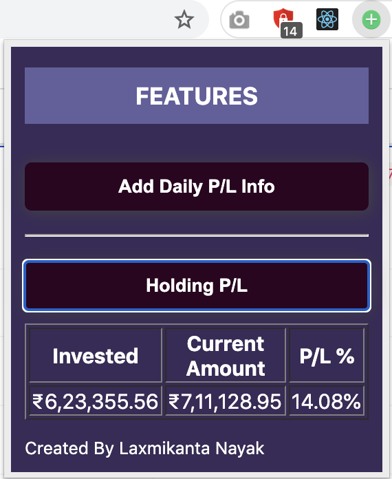
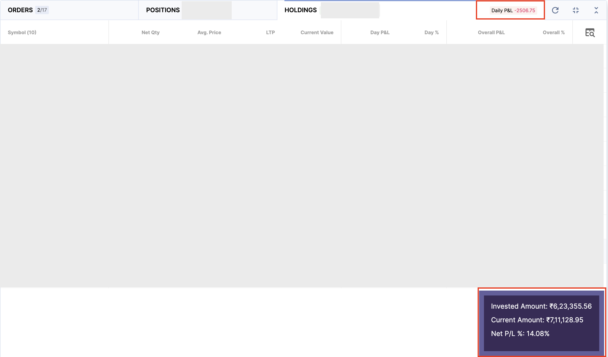

# Unoffcial upstox chrome extension

This unofficial chrome extension will help you with:

- Seeing Daily P/L on your holding
- Net P/L percentage on holding
- Net invested ammount
- Net current value of your investment

So that you can have a clear view of your account. Thees features are not there in upstox UI as of now.

### User guide:

- Install the extension on chrome.
- Login to your upstox account
- Go to holdings tab
- Click on the extension and use the features

## Extension tab view

## Upstox holding tab view

###### I have created it as a open source contributer not to sell it in any shape or form.
